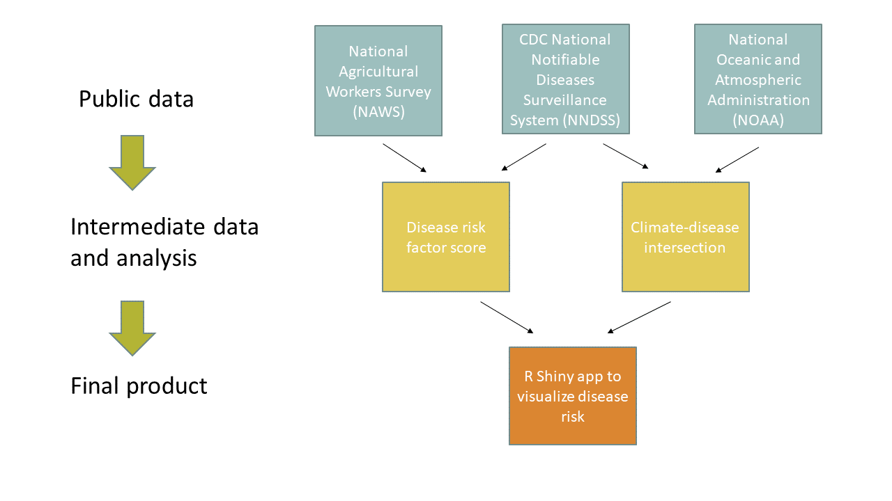

# Environmental infectious disease risk in agricultural workers

This project was part of the [June 2021 Health Disparities Codeathon run by the Office of Data Science Strategy at NIH and Howard University](https://datascience.nih.gov/participant-application-health-disparities-codeathon)

# What are environmental infectious diseases?

We use this term to include any infectious disease that has an environmental component in transmission. This could include mosquito-borne, tick-borne, fungal, zoonotic, waterborne, and soil-based diseases. Our initial tool will focus on Lyme Disease, Cryptosporidosis ("Crypto"), Dengue, and Campylobacteriosis ("Camp").

# What is the problem?

Environmental infectious diseases have significant mortality and morbidity and are expected to increase with climate change. This burden falls more on certain groups than others, and not everyone is equally equipped to mitigate their risk. One such group is agricultural workers who have risk factors such as environmental exposures (temperature, precipitation, etc.), access to healthcare, living in crowded housing, income and socioeconomic status, and various others.

Occupational health risk to agricultural workers in the United States has not been fully assessed. Existing research is limited to small groups, narrow data scope, or is outside of the United States. 

# Why should we solve it?

Accurately evaluating risk would illustrate the issue, encourage further research, and support interventions or policy protecting workers. This will become increasingly important as risk changes with climate.

# How are we going address this problem?

This project will begin to fill the research gap by integrating data sources and creating a web app with R shiny to visualize risk. This visualization tool will be shared with anyone who may benefit; from farm workers themselves to health departments to policymakers. We hope that this analysis will bring attention to the issue, ultimately inspiring interventions to protect agricultural workers in the face of increasing risks.

The workflow overview below shows where we got data and how it was processed to create our Shiny app.

# The Team, the team, the team:

 

Emerging Leaders in Data Science Fellows (ELFs),  
Office of Data Science and Emerging Technologies (ODSET),  
National Institute of Allergies and Infectious Diseases (NIAID),   
National Institutes of Health (NIH)

**Sydney Foote**, Team Lead  
**Mark Rustad**, Sysadmin  
**Lisa Mayer**, Writer  
**Meg Hartwick**, Float   
**Sara Jones**, Float

# How to use the Shiny app

## Access the app:

This is an online app that can be accessed by clicking [here](https://meghartwick.shinyapps.io/shiny/)

## Interact with the app:

1. This will be the first thing you see when you open the app.
2. This will be the second thing you should do when you get into the app.
3. etc.

## Troubleshooting

Add advice here if needed.

# Data sources and analysis

## National Agricultural Workers Survey (NAWS)
 
This survey is conducted by the U.S. Department of Labor, Employment and Training Administration. It is designed to assess both conditions of agricultural employment and demographics of workers. We used data from 2013 to 2016 and extracted variables pertaining to workers' demographics, income, healthcare access, baseline health, migrant status, and living conditions.

More information and additional data access can be found on the [NAWS website](https://www.dol.gov/agencies/eta/national-agricultural-workers-survey/overview).

## CDC National Notifiable Diseases Surveillance System (NNDSS)

This is a repository of data reported by states for notifiable diseases maintained by the US CDC. We extracted yearly summary data from 2016 to 2019 using their built-in API for the diseases of interest (Lyme, Cryptosporidosis ("Crypto"), Dengue, and Campylobacteriosis ("Camp")).

Additional details and data for other diseases is available in the [NNDSS annual tables](https://wonder.cdc.gov/nndss/nndss_annual_tables_menu.asp).

## National Oceanic and Atmospheric Administration (NOAA)

The NOAA Global Summary of the Year (GSOY) dataset includes a variety of climatic measures, updated weekly from around the world. We extracted average yearly temperature and preciptation for all weather stations within the United States due to their link with the environmental diseases of interest.

Further documentation and more data is available through the [NOAA GSOY webpage](https://www.ncei.noaa.gov/access/metadata/landing-page/bin/iso?id=gov.noaa.ncdc:C00947).

## Intermediate datasets
All analysis was done using R Studio in a virtual environment. 

### From NAWS:
Raw data was transformed into binary dummy variables, aiming to improve interpretability and emphasize criteria of highest interest. Variables associated with increased infectious disease risk were used to calculate a risk score at the individual level. The individual-level risks were averaged by region for each survey year.

### From CDC:

### From NOAA:
All data from United States-based weather stations in GSOY was identified and combined. Average yearly temperature (F) and precipitation (in) values were calculated for regions. 

## Building the Shiny app
Here we'll write some stuff about coding the app.

# Future Functionality
- Additional years of data  
- Ability to stratify by additional features such as race and ethnicity  
- More granular data 
- Projections based on past trends
